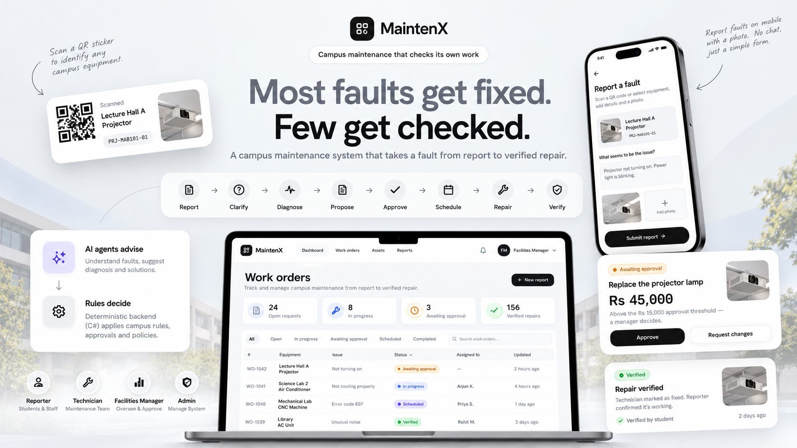
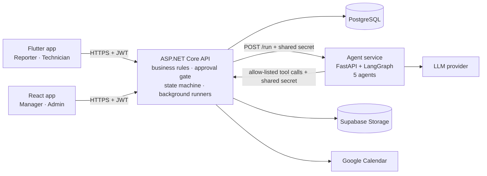

# MaintenX

**A campus maintenance system that follows a fault from report to a confirmed repair, with AI
agents that advise and deterministic C# that decides.**

SE3090 Software Engineering Frameworks — Assignment 1 · SLIIT · Year 3, Semester 1, 2026

<!-- System image: save the screenshot as assets/maintenx-overview.png and it appears here. -->
<p align="center">
  
</p>

| | |
|---|---|
| Web client | https://mainten-x-gray.vercel.app |
| API health | https://maintenx-api.onrender.com/health |
| API documentation (Swagger) | https://maintenx-api.onrender.com/swagger |
| Android APK | [GitHub Releases](https://github.com/Hiruna01/MaintenX/releases) (`mobile-v*` tags) |
| Repository | https://github.com/Hiruna01/MaintenX |

> The deployed services run on free plans and sleep after about 15 minutes idle. The first
> request after a quiet spell takes 30–45 seconds; everything after that is normal.

## Contents

1. [The problem and the solution](#1-the-problem-and-the-solution)
2. [Users and features](#2-users-and-features)
3. [Technology and why](#3-technology-and-why)
4. [Architecture](#4-architecture)
5. [Repository structure](#5-repository-structure)
6. [Running it locally](#6-running-it-locally)
7. [Environment variables](#7-environment-variables)
8. [API documentation](#8-api-documentation)
9. [Testing](#9-testing)
10. [Deployment](#10-deployment)
11. [Security](#11-security)
12. [Team and contributions](#12-team-and-contributions)
13. [Challenges](#13-challenges)
14. [AI usage declaration](#14-ai-usage-declaration)

---

## 1. The problem and the solution

On a campus, shared equipment (projectors, air conditioners, lab machines) fails and the
repair process is informal. Reports are vague ("the projector isn't working"), so technicians
make wasted visits. Repeat failures go unnoticed, because each complaint is handled on its own.
Whether a costly repair needs sign-off depends on who raises it. Visits are booked without
checking the timetable. And a closed job counts as a success even when the fault returns days
later.

MaintenX handles a fault as **one closed loop**:

> **Report → Clarify → Diagnose → Propose → Approve → Schedule → Repair → Verify**
> (and back to **Diagnose** if the repair did not hold)

A reporter files a fault on the phone, scanning the equipment's QR sticker and adding a photo.
Five AI agents do the reading-heavy work: they plan the case, ask at most two bounded
questions, read the machine's service history for likely causes and repeat failures, propose
a repair with a cost estimate, and later judge whether the repair held.

**Agents advise, C# decides.** Whether a work order needs a manager's approval, when a visit
can be booked, and whether a repair held are decided by deterministic rules in the API or by a
person, never by a model. There is **no chat interface** anywhere: every exchange with a
person is a bounded form.

## 2. Users and features

| Role | Who | Client | Can do |
|---|---|---|---|
| **Reporter** | Students and staff | Mobile | Sign up, report a fault (QR scan, photo), answer the agent's questions, confirm whether a repair held |
| **Technician** | Maintenance staff | Mobile | See assigned jobs with the asset's history and the diagnosis, complete a job with a photo |
| **Facilities Manager** | Head of maintenance | Web | Approve, reject or send back work orders; assign and schedule around the timetable; monitor workflows, agents and metrics |
| **Admin** | System administrator | Web | Manage assets, buildings, rooms and user accounts |

Roles are not a seniority ladder: an Admin cannot approve a work order. Anyone can register
on the phone, always as a Reporter; staff accounts are created by an Admin.

**Main features**

- **Fault reporting** with QR lookup, photo upload (with location and camera metadata
  removed) and at most two clarification questions (yes/no, a picker, or short text).
- **Asset registry** with service history, a failure summary (repeat failure over 90 days,
  warranty) and printable QR labels. Assets are retired, never deleted.
- **Work orders** through one approval gate: estimates above Rs 15,000, and any replacement,
  wait for a manager. Approve, reject with a reason, or send back for revision.
- **Scheduling** that offers only free slots, around classes mirrored from Google Calendar
  and the technician's other visits. A 7-day repair SLA starts at approval.
- **Verification** five days after a repair: the reporter is asked whether it held; "no"
  reopens the case for a second diagnosis.
- **Observability**: every agent run, tool call and approval decision on an audit trail; an
  agent monitoring page (runs, failures, latency, tokens, estimated cost); estate metrics.

## 3. Technology and why

| Part | Technology | Why |
|---|---|---|
| API | ASP.NET Core Web API (.NET 8), EF Core, JWT | Mandated. One layered project (controllers, services, DTOs, models, data) that holds every business rule |
| Database | PostgreSQL (16 in CI, Supabase in deployment) | Mandated. `jsonb` for agent output, real constraints, transactions |
| Agent service | Python 3.12, FastAPI, LangGraph, Pydantic | An explicit graph whose routing is plain Python; a separate process with **no database credentials** |
| Web | React 18 + Vite (JavaScript), React Router, Context | Built-in state is enough when the API owns the data; no Redux or other store |
| Mobile | Flutter, Riverpod, go_router, flutter_secure_storage | Android and iOS from one codebase; the token kept in the Keychain or encrypted storage |
| Integrations | Google Calendar API, Supabase Storage, an OpenAI-compatible LLM (OpenRouter) | The campus timetable, photos, and agent inference |
| Delivery | GitHub Actions, Render, Vercel, GitHub Releases | Free plans; migrations always run before the new code |

Each of these decisions, the options considered and their trade-offs are recorded as
Architecture Decision Records in Chapter 12 of the report.

## 4. Architecture



- **The clients talk only to the API.** Neither knows the agent service exists.
- **No request waits for an agent.** Filing a report saves it with its workflow, queues the
  workflow and returns at once. A background runner calls the agent service and records each
  agent's step; the phone polls until questions appear.
- **The agents read data only through seven read-only tools** on the API. The allow-list is a
  hard-coded dictionary in C#, and each agent may use only its own subset.

**The five agents**

| Agent | Job | Output |
|---|---|---|
| Planner | Plan the run; decide whether the reporter needs to be asked anything | 2–3 steps and a rationale, re-checked in C# |
| Clarifier | Ask only what would change the repair | 0–2 bounded questions |
| Diagnostic | Find likely causes from the service history | 1–3 causes with evidence and confidence |
| Resolution Strategist | Propose one repair strategy | Strategy, cost estimate, urgency, justification (no approval field) |
| Verification | Judge whether a completed repair held | confirm / reopen / escalate, recorded as advice |

Every reply is validated against a strict Pydantic schema, retried once with the error, then
recorded as a **safe failure** rather than an error. Workflow state moves only through a fixed
transition table in C#, and two human pauses (the reporter's answers, the manager's decision)
sit on the same audit trail.

**Database:** 15 tables built by 18 EF Core migrations. Workflow state lives in
`AgentWorkflows` and `AgentSteps`, with agent output in `jsonb`. The full schema is in
[`docs/report/diagrams/schema.dbml`](docs/report/diagrams/schema.dbml) (paste it into
dbdiagram.io for the ER diagram). The other diagrams (system architecture, agent graph, state
machine, end-to-end sequence) are Mermaid files in [`docs/report/diagrams/`](docs/report/diagrams/).

For a plain-language walk-through of the whole system, see
[`docs/guide/SYSTEM_OVERVIEW.md`](docs/guide/SYSTEM_OVERVIEW.md).

## 5. Repository structure

```
api/                 ASP.NET Core Web API (.NET 8): Controllers/ Services/ Models/ Dtos/ Data/ Middleware/
api.Tests/           xUnit integration tests (SQLite by default, PostgreSQL in CI)
agent/               Python agent service: main.py, graph.py, agents/, prompts/, schemas.py, tools.py
  tests/             pytest, offline (stubbed model, sockets blocked)
  evals/             live evaluations against a real model (cost money; run by hand)
web/                 React 18 + Vite: src/features/<name>/{components,hooks,services,pages}
mobile/              Flutter: lib/core, lib/router, lib/widgets, lib/features/<name>
docs/
  guide/             SYSTEM_OVERVIEW, TESTING_GUIDE (manual scenarios), DEPLOYMENT (runbook)
  report/            report chapters, diagrams/, evidence/ (recorded test and evaluation runs)
  performance/       k6 load tests and how to run them
  qr/                printable QR stickers for the seeded assets
  timetable/         the demo campus timetable (.ics) for Google Calendar
assets/              images used in this README
.github/workflows/   ci.yml, deploy.yml, mobile-release.yml
render.yaml          the Render blueprint for the API and the agent (names only, no values)
CLAUDE.md            the project's engineering conventions, rule by rule
```

## 6. Running it locally

### Prerequisites

- .NET 8 SDK
- Node.js 20 or later (CI uses 22)
- Python 3.12 (3.11 or later works)
- Flutter SDK, stable channel, with Android Studio or Xcode for an emulator or simulator
- PostgreSQL 16 or later, running locally (or any reachable PostgreSQL)

```bash
git clone https://github.com/Hiruna01/MaintenX.git
cd MaintenX
cp .env.example .env
```

`.env` is git-ignored; never commit it. The agent service reads it automatically. The API does
**not** (it has no dotenv loader), so the API's values go into `dotnet user-secrets`, below.

### Start order

**PostgreSQL → API → agent service → web and mobile.** The API re-queues any unfinished agent
run when it starts, so the agent service can also be started second.

### 1. API (http://localhost:5138)

`appsettings.Development.json` is git-ignored, so a fresh clone has no database password, no
signing key and no seed passwords. Everyone sets their own with `dotnet user-secrets`, which
keeps values in your home directory, outside the repository. Run these once, with your own
values:

```bash
dotnet user-secrets set "ConnectionStrings:DefaultConnection" "Host=localhost;Port=5432;Database=campusfacilities;Username=postgres;Password=YOUR_POSTGRES_PASSWORD" --project api
dotnet user-secrets set "Jwt:Secret" "a-long-random-string-of-at-least-32-characters" --project api
dotnet user-secrets set "Jwt:Issuer" "CampusFacilities.Api" --project api
dotnet user-secrets set "Jwt:Audience" "CampusFacilities.Clients" --project api
dotnet user-secrets set "Agent:BaseUrl" "http://localhost:8000" --project api
dotnet user-secrets set "Agent:SharedSecret" "THE-SAME-VALUE-AS-AGENT_SHARED_SECRET-IN-.env" --project api
dotnet user-secrets set "Cors:AllowedOrigins:0" "http://localhost:5173" --project api
```

The four demo accounts are created only if you give them passwords (a blank one skips that
user):

```bash
dotnet user-secrets set "Seed:Passwords:Reporter" "CHOOSE-A-PASSWORD" --project api
dotnet user-secrets set "Seed:Passwords:Technician" "CHOOSE-A-PASSWORD" --project api
dotnet user-secrets set "Seed:Passwords:FacilitiesManager" "CHOOSE-A-PASSWORD" --project api
dotnet user-secrets set "Seed:Passwords:Admin" "CHOOSE-A-PASSWORD" --project api
```

Create the schema and start the API. The `dotnet-ef` version is pinned in
`.config/dotnet-tools.json`:

```bash
dotnet tool restore
dotnet ef database update --project api
dotnet run --project api
```

On the first run you should see four `Seeding demo user ...` lines. The demo data (8 assets
with service history, rooms, reports, work orders and repair checks) is seeded automatically in
Development and is idempotent. The accounts are `reporter@`, `technician@`, `manager@` and
`admin@campus.test`. `dotnet user-secrets list --project api` shows what you have set.

<details>
<summary><b>Optional: photo uploads (Supabase Storage)</b></summary>

Without these the API still starts, and `POST /api/reports/{id}/photo` returns 503. Create a
**public** bucket named `photos` in a Supabase project (Storage → New bucket), then:

```bash
dotnet user-secrets set "Supabase:Url" "https://YOUR_PROJECT_REF.supabase.co" --project api
dotnet user-secrets set "Supabase:ServiceKey" "YOUR_SERVICE_ROLE_KEY" --project api
```

The service-role key bypasses every Storage policy: it belongs in user-secrets on the API and
nowhere else.
</details>

<details>
<summary><b>Optional: the campus timetable (Google Calendar)</b></summary>

The slot finder books maintenance around classes mirrored from a Google Calendar. Without
these the API still starts, but every room looks free. There is no OAuth screen, only a
service account:

1. In the [Google Cloud console](https://console.cloud.google.com/), create a project and
   enable the **Google Calendar API**.
2. IAM & Admin → Service Accounts → create one (no roles needed) → Keys → Add key → JSON.
   Keep the file outside the repository and delete it once it is in user-secrets.
3. In a Google account, create a calendar named **Campus Timetable** and import
   [`docs/timetable/campus-timetable.ics`](docs/timetable/campus-timetable.ics): 15 weekly
   lectures in the seeded rooms. Each event's location is a room code, which is how it is
   matched to a room.
4. Share the calendar with the service account's email (**See all event details**) and copy
   the **Calendar ID** from Integrate calendar.

```bash
dotnet user-secrets set "Google:ServiceAccountJsonBase64" "$(base64 -i path/to/key.json)" --project api
dotnet user-secrets set "Google:CalendarId" "YOUR_CALENDAR_ID@group.calendar.google.com" --project api
```

`base64 -i` is the macOS form; on Linux use `base64 -w0 key.json`, and in PowerShell
`[Convert]::ToBase64String([IO.File]::ReadAllBytes("key.json"))`. The API syncs at start-up
and hourly; a Facilities Manager can sync now from the work order page. A sync answering
`"failureReason": "Rejected"` usually means the calendar is not shared with the service account.
</details>

<details>
<summary><b>Other ways to supply the same values</b></summary>

Configuration is layered, each level overriding the one before:
`appsettings.json` < `appsettings.Development.json` < user-secrets < environment variables.
Environment variables use `__` where a key has `:` (`Seed__Passwords__Reporter`), and the API
also accepts the flat names in `.env.example` (`DATABASE_URL`, `JWT_SECRET`,
`AGENT_SHARED_SECRET`, …) when they are exported into its environment.
</details>

### 2. Agent service (http://localhost:8000)

In `.env`, set `AGENT_SHARED_SECRET` (the same value as the API's), `API_BASE_URL=http://localhost:5138`,
and either a model (`LLM_BASE_URL`, `LLM_API_KEY`, `LLM_MODEL`, for example OpenRouter) or
`STUB_MODE=true` for fixed replies with no model and no cost. Then:

```bash
cd agent
python3 -m venv .venv
source .venv/bin/activate        # Windows: .venv\Scripts\activate
pip install -r requirements.txt
uvicorn main:app --reload --port 8000
```

Run it from `agent/`: the app is `main:app` (there is no `app/` package). Check it with
`curl localhost:8000/health` before filing a report.

### 3. Web client (http://localhost:5173)

```bash
cd web
npm install
cp .env.example .env             # VITE_API_BASE_URL defaults to http://localhost:5138
npm run dev
```

### 4. Mobile client

```bash
cd mobile
flutter pub get
flutter run                      # Android emulator → local API at http://10.0.2.2:5138
flutter run --dart-define=API_BASE_URL=http://localhost:5138                # iOS simulator
flutter run --dart-define=API_BASE_URL=https://maintenx-api.onrender.com    # deployed API
```

The API address is fixed at build time with `--dart-define`; nothing secret goes in it. To
demonstrate QR scanning, print [`docs/qr/asset-qr-sheet.png`](docs/qr/asset-qr-sheet.png) at
100%: one sticker for each seeded asset.

**Installing the released APK:** download it from the latest `mobile-v*` GitHub Release on an
Android phone, open it, and allow installation from that source when Android asks. It is
built against the deployed API and needs no configuration.

## 7. Environment variables

Every variable is listed, with a one-line comment, in [`.env.example`](.env.example) (the web
client's single variable is in [`web/.env.example`](web/.env.example)). The main ones:

| Variable | Used by | Purpose |
|---|---|---|
| `DATABASE_URL` | api | PostgreSQL connection string (Npgsql key/value form) |
| `JWT_SECRET`, `JWT_ISSUER`, `JWT_AUDIENCE` | api | Token signing key (32+ characters), issuer and audience |
| `AGENT_SERVICE_URL` | api | Base URL of the agent service |
| `AGENT_SHARED_SECRET` | api, agent | Shared secret for API → agent and agent → API calls; empty rejects everything |
| `API_BASE_URL` | agent | The API's address, for tool calls |
| `LLM_BASE_URL`, `LLM_API_KEY`, `LLM_MODEL` | agent | The OpenAI-compatible model provider; the key lives in the agent only |
| `STUB_MODE` | agent | `true`: fixed valid replies, no model and no network (tests) |
| `SUPABASE_URL`, `SUPABASE_SERVICE_KEY`, `SUPABASE_STORAGE_BUCKET` | api | Photo storage; the service key is server-side only |
| `GOOGLE_SERVICE_ACCOUNT_JSON_BASE64`, `GOOGLE_CALENDAR_ID` | api | The campus timetable |
| `Cors__AllowedOrigins__0` | api | The web client's origin |
| `SEED_DEMO_DATA`, `Seed__Passwords__*` | api | Demo data outside Development, and the four demo passwords |
| `SWAGGER_ENABLED` | api | Swagger outside Development |
| `APPROVAL_COST_THRESHOLD`, `SLA_RESOLUTION_DAYS`, `VERIFICATION_DELAY_DAYS`, … | api | Business settings (defaults Rs 15,000, 7 days, 5 days) |
| `RATE_LIMIT_AUTH_PER_MINUTE`, `RATE_LIMIT_REPORTS_PER_HOUR` | api | Sign-in and report budgets (default 10 each) |
| `LLM_INPUT_PRICE_PER_MILLION_TOKENS_USD`, `LLM_OUTPUT_…` | api | Optional, for the estimated cost on Agent monitoring |
| `VITE_API_BASE_URL` | web | The API's address (public by definition) |

Never put `JWT_SECRET`, `SUPABASE_SERVICE_KEY`, `GOOGLE_SERVICE_ACCOUNT_JSON_BASE64` or
`LLM_API_KEY` in the web or mobile client.

## 8. API documentation

Swagger UI documents every endpoint and lets you call them with a bearer token: locally at
http://localhost:5138/swagger, deployed at https://maintenx-api.onrender.com/swagger. Sign in
with `POST /api/auth/login`, then use **Authorize** with the returned token.

There are 65 endpoints across 13 controllers. The main ones:

| Area | Endpoint | Role |
|---|---|---|
| Auth | `POST /api/auth/register`, `POST /api/auth/login` | Anonymous (registration always creates a Reporter) |
| Assets | `GET /api/assets`, `GET /api/assets/by-tag/{tag}`, `GET /api/assets/{id}/failure-summary` | Any signed-in user |
| | `POST`, `PUT`, `DELETE /api/assets/{id}` (delete retires) | Admin |
| Reports | `POST /api/reports`, `POST /api/reports/{id}/photo`, `GET`/`POST /api/reports/{id}/clarifications` | Reporter (their own) |
| Work orders | `GET /api/workorders/approvals`, `POST /api/workorders/{id}/approve` · `/reject` · `/request-revision` | Facilities Manager |
| | `GET /api/workorders/slots/available`, `POST /api/workorders/{id}/schedule` | Facilities Manager |
| | `POST /api/workorders/{id}/complete`, `POST /api/workorders/{id}/photo` | The assigned Technician |
| Verification | `GET /api/verifications`, `POST /api/verifications/{id}/confirm` | Reporter (their own) |
| Workflows | `GET`/`POST /api/workflows` | Manager, Admin |
| | `POST /api/workflows/verification-sweep` (run the sweep now) | Facilities Manager |
| Analytics | `GET /api/analytics/metrics`, `GET /api/analytics/agents` | Manager, Admin |
| Users | `/api/users` (create, edit, deactivate, reset password) | Admin |
| Health | `GET /health` | Anonymous |

No token is **401**; a valid token with the wrong role, or someone else's record, is **403**.
Errors are ProblemDetails JSON.

## 9. Testing

| Suite | Command | What it covers |
|---|---|---|
| API (xUnit) | `dotnet test api.Tests` | Integration tests through the real pipeline on SQLite in memory |
| API on PostgreSQL | `TEST_DATABASE_URL="Host=localhost;Port=5432;Database=postgres;Username=postgres;Password=…" dotnet test api.Tests` | The same tests on PostgreSQL with every migration applied (one database per test class, dropped afterwards) |
| Agent (pytest) | `cd agent && pytest` | Offline: stubbed model, network sockets blocked |
| Web (Vitest) | `cd web && npm run lint && npm test` | Components, hooks, routing and role guards; `fetch` is stubbed |
| Mobile | `cd mobile && flutter analyze && flutter test` | Widget and unit tests; no camera or network needed |

**CI** ([`.github/workflows/ci.yml`](.github/workflows/ci.yml)) runs all four on every push and
pull request to `main`: the API against a PostgreSQL 16 service container with the migrations
applied, the agent in stub mode, the web lint, tests and build, and `flutter analyze` and
`flutter test`. It needs no secrets.

**Live evaluations** call a real model and cost money, so they are not in CI. From `agent/`,
with a model configured in `.env`:

```bash
RUN_LIVE_EVALS=1 pytest evals/ -v
```

Set `EVAL_RECORD_PATH=…/replies.jsonl` to record every model reply. Recorded runs are in
[`docs/report/evidence/`](docs/report/evidence/).

**Manual end-to-end scenarios**, step by step and role by role:
[`docs/guide/TESTING_GUIDE.md`](docs/guide/TESTING_GUIDE.md). **Performance tests** (k6):
[`docs/performance/README.md`](docs/performance/README.md).

## 10. Deployment

| Part | Where | How |
|---|---|---|
| API | Render (Docker, free, Singapore) | `api/Dockerfile`, from [`render.yaml`](render.yaml) |
| Agent service | Render (Python 3.12, free, Singapore) | From `render.yaml`; reached by the API only |
| Database | Supabase PostgreSQL (Singapore) | Session pooler; schema built only by the deploy workflow |
| Photos | Supabase Storage | A separate project with a public `photos` bucket |
| Web | Vercel | Builds from `main`; [`web/vercel.json`](web/vercel.json) serves the single-page app |
| Android APK | GitHub Releases | [`mobile-release.yml`](.github/workflows/mobile-release.yml) on a `mobile-v*` tag |

**Merging to `main` deploys.** CI runs; then [`deploy.yml`](.github/workflows/deploy.yml)
applies the EF Core migrations to Supabase and only then redeploys the two Render services, so
new code never starts against an old schema. Migrations are never run from a laptop. Every
secret is a host environment variable; `render.yaml` holds names only.

**Test accounts on the deployed system**

| Role | Email | Use it on |
|---|---|---|
| Reporter | `reporter@campus.test` | Phone |
| Technician | `technician@campus.test` | Phone |
| Facilities Manager | `manager@campus.test` | Web |
| Admin | `admin@campus.test` | Web |

The passwords are given in the submitted report, not here, because this repository is public.

The full runbook (every variable per service, Supabase, Render, Vercel and GitHub setup,
checks after a deploy, and rollback) is [`docs/guide/DEPLOYMENT.md`](docs/guide/DEPLOYMENT.md).

## 11. Security

- **Authentication:** JWT bearer tokens (12 hours, no refresh tokens by design), passwords
  hashed with salted PBKDF2. Every request re-checks that the account is still active and
  still holds its role, so a deactivation takes effect at once.
- **Authorisation:** one policy per role, and a fallback policy so that every endpoint needs a
  signed-in user unless it is explicitly public (only login, register, `/health` and the agent
  tool router). Ownership is checked in the services.
- **Input:** validation on every DTO; input DTOs never carry an id, status or owner. Money is
  `decimal` with database CHECK constraints. Uploads are checked by type, size and file
  signature, and their metadata (GPS, camera) is removed before storage.
- **Abuse:** rate limits on sign-in (10 a minute per address) and on filing reports (10 an hour
  per user), answering 429 with `Retry-After`.
- **Secrets:** none in the repository. User-secrets locally, host environment variables in
  deployment. Request logs never include bodies, so no password reaches a log.
- **The AI boundary:** the agent service has no database credentials, a shared secret guards
  both directions, tools are a hard-coded read-only allow-list, user text reaches a model only
  as one JSON data block, and no agent output can approve spending or change a workflow's state.

Chapter 7 of the report covers each of these in detail, with the known limitations.

## 12. Team and contributions

Four primary business components, one per student. Each spans the API, the database, React,
Flutter and one agent.

| Component | Owner | Main work | Agent |
|---|---|---|---|
| **A.** Asset registry and orchestration | _[Name, IT number]_ | Assets, service history, failure summary, QR lookup, buildings and rooms, the workflow runner | Diagnostic |
| **B.** Fault reporting and clarification | _[Name, IT number]_ | Reports, bounded clarification, report lifecycle, photo upload | Clarifier |
| **C.** Work orders, approval and scheduling | _[Name, IT number]_ | Approval gate, manager decisions, slot finder, completion, SLA, timetable sync | Resolution Strategist |
| **D.** Verification and analytics | _[Name, IT number]_ | Delayed verification, reporter confirmation, reopen rates and metrics | Verification |

The Planner agent, which coordinates every run, is owned by _[Name]_. Each member's
contribution statement, key commits, pull requests and tests are in their Individual Report
section of the consolidated report.

## 13. Challenges

- **Free-tier hosting.** Render's free services sleep, so the first request takes 30–45 s. The
  phone waits 60 s, the API allows 360 s for an agent call, and unfinished agent runs are
  re-queued when the API starts.
- **No IPv6.** Supabase's direct database host is IPv6-only on the free plan, and neither Render
  nor GitHub's runners have IPv6. The fix was the session pooler, without EF's retrying
  strategy, which conflicts with the services' own transactions.
- **A mixed Windows and macOS team.** A Windows checkout showed the whole tree as modified;
  `.gitattributes` now normalises every text file to LF.
- **Agent calls timing out.** A 60 s limit failed runs that the agent was still working on; the
  limit was budgeted from the agent's worst case (360 s). A wrong start command (`app.main:app`)
  also looked like a network fault, because the port stayed bound after the worker died.
- **Bugs only PostgreSQL can show.** A list sorted on a column with ties needs a tie-break, or
  a row can appear on two pages. SQLite hides this by returning tied rows in insertion order,
  and it never runs the migrations at all, so CI runs the whole API suite on PostgreSQL with
  the real migrations.
- **A workflow that stalled after the strategist.** Nothing raised the proposed work order, so
  the run waited forever. The runner now raises it through the same approval gate a manager
  uses, and a manager can raise it from the report page when the runner cannot.
- **A frozen web page.** A dropdown's closing animation left the page unclickable after every
  choice; open and close animations were split.

## 14. AI usage declaration

The assignment is set at AI Use Level 4 (Full AI) for development and Level 1 (No AI) for the
final demonstration and viva. AI tools were used during development and are disclosed in full
in the consolidated report: the group's declaration is Chapter 14, and each member's AI usage
log and reflection are in their Individual Report section.

- **Tool:** Claude Code (Anthropic), an agentic coding tool, with Claude Opus 5, Claude Sonnet 5
  and Claude Opus 5.5. _[Add any other tools the members used.]_
- **Used for:** code in every part of the system, tests, CI and deployment configuration,
  running the evaluations and performance tests, and drafting the documentation and report.
- **Checked by:** pull requests with CI; 1,203 automated tests; live evaluations on the real
  model; k6 measurements; an end-to-end check of the deployed system; and the team's own review.
  Every result in the report comes from a run that was actually executed.
- **Not used:** in the final demonstration and viva. The language model inside MaintenX
  (google/gemini-3.8-flash through OpenRouter) is part of the product, not development help.

The engineering conventions the team and the tools followed are in [`CLAUDE.md`](CLAUDE.md).
