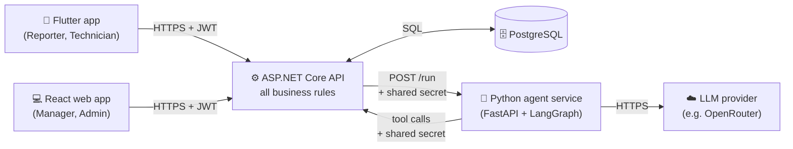
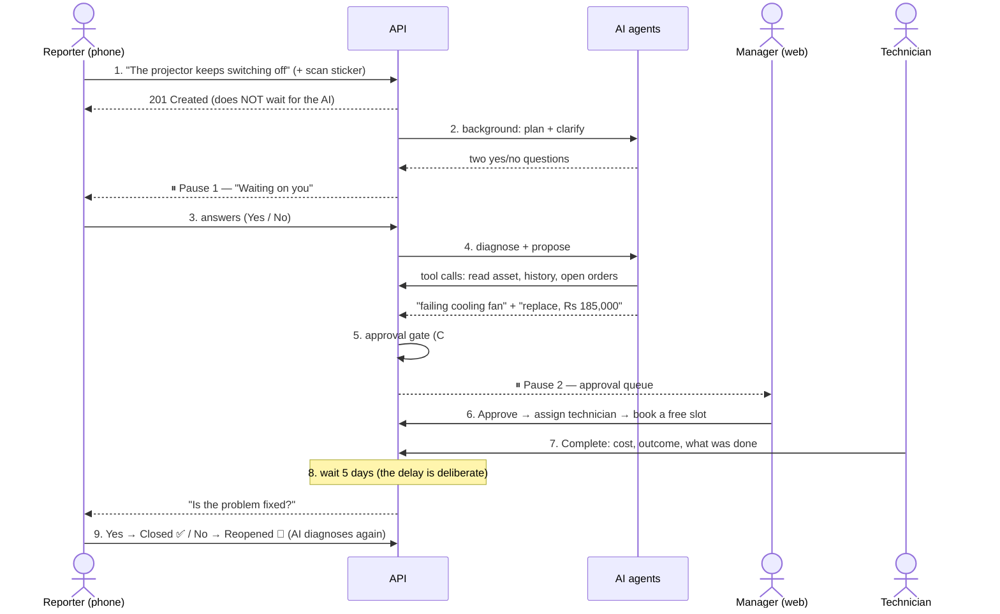
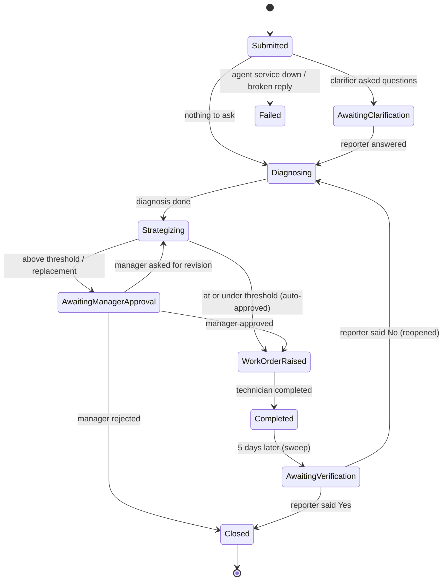

# MaintenX — the system, explained for beginners

This is the "read me first" for anyone new to MaintenX: a teammate, a reviewer, or you
before a viva. It explains **what the system does, who uses it, how the parts fit together,
and why it is built the way it is** — without assuming you have read the code.

- Want to **run and test** it? → [TESTING_GUIDE.md](TESTING_GUIDE.md)
- Want the **exact rules** a developer must follow? → [CLAUDE.md](../../CLAUDE.md)
- Want the **formal architecture chapter** for the report? → [03-architecture.md](../report/03-architecture.md)

---

## 1. The problem in one paragraph

On a university campus, things break: a projector cuts out mid-lecture, an air conditioner
stops cooling. Usually someone complains, a technician is sent, they do a quick fix, and the
same fault comes back a month later — and nobody notices the *pattern*, because each
complaint is handled on its own. **MaintenX follows a fault from the moment someone reports
it to the day we confirm the repair actually held.** AI agents read the machine's repair
history to spot patterns and suggest what to do. People still make every real decision, and
fixed business rules written in C# decide the rest.

## 2. The four kinds of user (roles)

| Role | Who they are | What they do | Where they work |
|---|---|---|---|
| **Reporter** | A student or lecturer | Reports a fault, answers a few quick questions, later says whether the fix held | 📱 Phone app |
| **Technician** | Maintenance staff | Sees the jobs assigned to them, does the work, writes what they did | 📱 Phone app (or web) |
| **Facilities Manager** | Runs maintenance | Approves expensive work, assigns technicians, books visits, watches the metrics | 💻 Web app |
| **Admin** | System owner | Manages the equipment register, buildings, rooms and staff accounts | 💻 Web app |

> A role is **not** a seniority level. An Admin cannot approve a work order, because approving
> is the Facilities Manager's job. Every permission is given to a named role on purpose.

## 3. The five building blocks

| Block | Folder | Think of it as… |
|---|---|---|
| **API** (C#, .NET 8) | `api/` | **The brain and the rulebook.** Every rule, every save, every login check. |
| **Database** (PostgreSQL) | — | **The memory.** Only the API can talk to it. |
| **Agent service** (Python) | `agent/` | **The advisers.** Five AI agents that read facts and *give advice*. They cannot change anything. |
| **Web app** (React) | `web/` | The manager's and admin's desk. |
| **Phone app** (Flutter) | `mobile/` | The reporter's and technician's pocket tool. |

**Three golden rules shape everything:**

1. **The apps only talk to the API.** The phone and web never call the AI service directly.
2. **The AI service has no database password.** It can only *ask* the API for facts, through
   a short fixed list of allowed "tools" (for example `get_asset_service_history`).
3. **Every fixed rule lives in C#, never in an AI prompt.** For example: "above Rs 15,000
   needs a manager", "3 visits in 90 days is a repeat failure", "ask the reporter 5 days after
   the repair". The AI may *suggest* a cost, but C# decides whether a manager must approve it.

## 4. The life of one fault (the story)

Here is the whole journey, using the demo projector `PRJ-MAB101-01` in Lecture Hall A.

Step by step, in plain words:

1. **Report.** The reporter picks the room, types what is wrong, and can scan the QR sticker
   on the machine (the sticker holds only the asset tag, such as `PRJ-MAB101-01`). The API
   saves the report and replies **immediately**. The AI runs later, in the background.
2. **Plan and clarify.** The **Planner** agent decides whether questions are needed. If so,
   the **Clarifier** asks **at most two** questions, each answered with a toggle, a picker or
   a short text (100 characters max). **There is no chat box, anywhere, on purpose.**
3. **Answer.** The reporter answers the form on the phone, in one go.
4. **Diagnose and propose.** The **Diagnostic** agent reads the machine's service history and
   names likely causes, with evidence ("2026-09-02: fan bearing sounds weak…"). The
   **Strategist** proposes one plan (for example "replace, Rs 185,000").
5. **Approval gate (C#).** If the estimate is **above** the threshold (Rs 15,000 by default)
   or it replaces equipment, the order waits for a manager. Otherwise it is approved at once.
6. **Manager.** Approves, rejects (with a reason) or sends it back for revision (with a
   note). Then assigns a technician and books a visit. The slot finder avoids lectures in the
   room, using the campus timetable.
7. **Technician.** Does the job and completes it: actual cost, an outcome (Resolved /
   TemporaryFix / PartReplaced / NoFaultFound) and a note of at least 20 characters. That
   note becomes part of the machine's permanent history.
8. **Wait.** Five days later a background "sweep" asks the reporter. Asked the same
   afternoon, everyone says "yes", because an intermittent fault hasn't had time to return.
9. **Verify.** The reporter answers **Yes** (the case closes) or **No, still broken** (the case
   reopens and the AI diagnoses again, now knowing about the failed repair). The
   **Verification** agent also gives its opinion (confirm / reopen / escalate), but only as
   advice. The reporter's answer is what counts.

## 5. The two "human pauses"

The AI never runs all the way to the end on its own. It stops twice and waits for a person:

| Pause | Waits for | Why |
|---|---|---|
| **Pause 1** — clarification | The reporter's answers | The report was too vague to diagnose well |
| **Pause 2** — approval | A manager's decision | The work costs above the threshold, or replaces equipment |

## 6. The workflow state machine

Every report gets a **workflow**: one "run" of the agents. Its state can only change along
the arrows below. The table lives in `api/Services/WorkflowTransitions.cs`, and any other
move is refused with **409 Conflict**.

*(Simplified: `InProgress` and a few `Failed` edges are left out. The code has the complete table.)*

**Three different "statuses".** Don't mix them up:

| Thing | Describes | Example values |
|---|---|---|
| **Workflow state** | Where one AI run has got to | `Diagnosing`, `AwaitingManagerApproval`, `Failed` |
| **Report status** | Where the *fault* has got to | `Submitted`, `Clarified`, `WorkOrderRaised`, `Closed` |
| **Reporter's stage** | What the reporter is shown, in friendly words | "Being reviewed", "Waiting on you", "Repair planned", "Repaired" |

## 7. The AI agents — advisers, not decision-makers

| Agent | Question it answers | Output | Can it change anything? |
|---|---|---|---|
| **Planner** | Do we need to ask the reporter anything? | 2–3 step plan | No |
| **Clarifier** | What would change what the technician does? | 0–2 bounded questions | No |
| **Diagnostic** | What is probably wrong, and what's the evidence? | 1–3 causes + next action | No |
| **Strategist** | What should we do and roughly what will it cost? | 1 strategy + estimate | No. C# decides approval. |
| **Verification** | Did the repair hold? | confirm / reopen / escalate | No. The reporter's answer decides. |

How they are kept safe:

- **Allowed tools only.** The list of tools is hard-coded in C# (`InternalToolsController`). An
  unknown tool gets 404 and is logged. Tools return **facts** only. There is deliberately no
  `diagnose` or `approve` tool.
- **Validated output.** Every reply is checked against a strict schema (Pydantic). A bad
  reply is **retried once**, then becomes a "safe failure": the system carries on and a
  human can still act.
- **Full audit trail.** Every agent run and every tool call is saved as an `AgentStep`. On
  the web you can open a report or workflow and read exactly what each agent saw and said.
- **Prompt injection.** Text people typed is passed to the model as data (inside a JSON
  block), never as instructions.

## 8. Rules that are C#, not AI (examples)

| Rule | Where | Default |
|---|---|---|
| Needs a manager if estimate **>** threshold, or it's a replacement | `WorkOrderService` (approval gate) | Rs 15,000 (exactly 15,000 does *not* need one) |
| Repeat failure = 3+ visits in the last **90 days** | `FailureRules` | — |
| Ask the reporter N days after completion | `VerificationSettings` | 5 days |
| Maintenance slots avoid classes ± buffer, working hours only | `SlotRules` | 15 min, 08:00–17:00 Colombo |
| Who can see which reports / orders | `ReportService`, `WorkOrderService` | Reporter sees only their own |

## 9. Security in one minute

- **Login** gives a **JWT** (a signed token), valid 12 hours, with no refresh token (a
  deliberate scope choice).
- **401 vs 403.** No token gets **401** ("who are you?"). A valid token with the wrong role
  gets **403** ("I know you, and no").
- Everything needs a login unless it is one of **four** public endpoints: login, register,
  `/health`, and the agent's tool router (which checks a shared secret instead).
- **Anyone can sign up on the phone, but only as a Reporter.** Only an Admin can create
  staff accounts.
- The phone stores the token in **secure storage** (Keychain / encrypted prefs), never in
  plain SharedPreferences.
- Photos have their hidden metadata (such as GPS) stripped before they are stored.

## 10. Demo data you get for free

When the API starts in Development it **seeds** the database:

- **2 buildings, 6 rooms** (e.g. `MAB-101` Lecture Hall A, `ENG-101` Computer Lab 1).
- **8 assets** with QR stickers (printable sheet: [`docs/qr/asset-qr-sheet.png`](../qr/asset-qr-sheet.png)).
- **`PRJ-MAB101-01` is the planted pattern.** Three visits over four months, the same overheating
  fault returning. Each note looks harmless on its own; together they point to a failing
  fan. This is what the diagnostic agent is meant to discover.
- **4 demo users** (created only if you configured seed passwords):
  `reporter@campus.test`, `technician@campus.test`, `manager@campus.test`, `admin@campus.test`.
- **3 live work orders** (2 waiting for approval, 1 approved and unassigned), and
  **6 completed repairs** with verification checks, 3 of which are already waiting on the
  reporter.

## 11. Where things are in the code

| I want to understand… | Look at |
|---|---|
| How a report starts the AI | `api/Services/ReportService.cs` → `WorkflowService.StartAsync` |
| The background worker that drives the agents | `api/Services/WorkflowRunner.cs` |
| The allowed state changes | `api/Services/WorkflowTransitions.cs` |
| The approval gate | `api/Services/WorkOrderService.cs` (`ApprovalBasisFor`, `RouteThroughGateAsync`) |
| The agents' order and routing | `agent/graph.py` |
| One agent's logic / its prompt | `agent/agents/*.py`, `agent/prompts/*.md` |
| The allowed tools | `api/Controllers/InternalToolsController.cs` |
| The verification sweep | `api/Services/VerificationService.cs`, `VerificationSweepService.cs` |
| Web pages | `web/src/features/<feature>/pages/` |
| Phone screens | `mobile/lib/features/<feature>/` |

## 12. Glossary

| Term | Meaning |
|---|---|
| **Asset** | One physical machine, identified by its **asset tag** (the QR sticker text). Never deleted, only *retired*. |
| **Report** | A fault someone reported. |
| **Workflow** | One AI run for a report. A report can have several (e.g. after a failed repair). |
| **Agent step** | One saved line in the audit trail: an agent run, a tool call, or an approval event. |
| **Clarification** | The bounded questions the AI asks the reporter (max 2). |
| **Work order** | Live work: raised → approved → assigned → scheduled → completed. |
| **Service record** | The permanent history line left behind when a work order completes. |
| **Approval gate** | The C# rule that decides whether a manager must approve a work order. |
| **Verification check** | "Did the repair hold?" asked N days after completion. |
| **Sweep** | The hourly background job that moves due checks forward (also a "Run sweep now" button). |
| **Safe failure** | An agent reply that could not be validated. The run records it and carries on, and nothing crashes. |
| **STUB_MODE** | Agent setting that returns fixed fake replies with no AI calls. Used by automated tests. |
| **Seed data** | Demo data created automatically in Development. |

## 13. Likely viva questions

- *Why is there no chat?* → Every answer is bounded (a toggle, a picker, or 100 characters of
  text). A chat would make the system unpredictable and impossible to audit.
- *Why does the AI not decide approvals?* → Arithmetic a model does can't be audited. The
  threshold comparison is C#, and the strategist's prompt is never even told the threshold.
- *Why wait 5 days before asking?* → A same-day "yes" means nothing for an intermittent fault.
- *Why `decimal` for money?* → A `float` could put an estimate a hair under the threshold and
  auto-approve it.
- *Why can the AI service not read the database?* → Least privilege. It gets only the facts
  the allow-listed tools return, and every call is recorded.
- *What happens if the AI service is down?* → The workflow goes to `Failed` with the reason,
  and a manager can still raise the work order by hand. Missing advice never blocks action.
